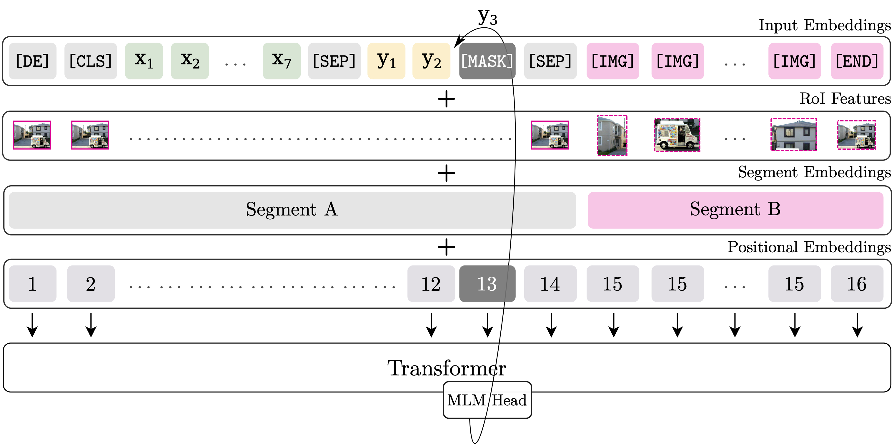

# BERTGEN

This repository is the implementation of the paper "BERTGEN: Multi-task Generation through BERT"  (https://arxiv.org/abs/2106.03484). The codebase is based on the VL-BERT official repository (https://github.com/jackroos/VL-BERT) presented in the paper 
[VL-BERT: Pre-training of Generic Visual-Linguistic Representations](https://arxiv.org/abs/1908.08530).


## Introduction

BERTGEN extends the VL-BERT model by making it multilingual, inheriting multilingual pretraining from multilingual BERT (https://github.com/google-research/bert/blob/master/multilingual.md. The BERTGEN model produces multilingual, multimodal embeddings usede for  visual-linguistic generation tasks. 

 BERTGEN takes advantage of large-scale training of VL-BERT and M-BERT but is also further trained, in a generative setting as described in the paper.



**Figure 1:** Overview of the BERTGEN architecture

Special thanks to VL-BERT, PyTorch and its 3rd-party libraries and BERT. This codebase also uses the following features inherited from VL-BERT:
* Distributed Training
* FP16 Mixed-Precision Training
* Various Optimizers and Learning Rate Schedulers
* Gradient Accumulation
* Monitoring the Training Using TensorboardX

## Prepare

### Environment
* Ubuntu 16.04, CUDA 9.0, GCC 4.9.4
* Python 3.6.x
    ```bash
    # We recommend you to use Anaconda/Miniconda to create a conda environment
    conda create -n bertgen python=3.6 pip
    conda activate bertgen
    ```
* PyTorch 1.0.0 or 1.1.0
    ```bash
    conda install pytorch=1.1.0 cudatoolkit=9.0 -c pytorch
    ```
* Apex (optional, for speed-up and fp16 training)
    ```bash
    git clone https://github.com/jackroos/apex
    cd ./apex
    pip install -v --no-cache-dir --global-option="--cpp_ext" --global-option="--cuda_ext" ./  
    ```
* Other requirements:
    ```bash
    pip install Cython
    pip install -r requirements.txt
    ```
* Compile
    ```bash
    ./scripts/init.sh
    ```

### Data

See [PREPARE_DATA.md](data/PREPARE_DATA.md).

### Pre-trained Models

See [PREPARE_PRETRAINED_MODELS.md](model/pretrained_model/PREPARE_PRETRAINED_MODELS.md).


## Training

### Distributed Training on Single-Machine

```
./scripts/dist_run_single.sh <num_gpus> <task>/train_end2end.py <path_to_cfg> <dir_to_store_checkpoint>
```
* ```<num_gpus>```: number of gpus to use.
* ```<task>```: LanguageGeneration.
* ```<path_to_cfg>```: config yaml file under ```./cfgs/<task>```.
* ```<dir_to_store_checkpoint>```: root directory to store checkpoints.


Following is a more concrete example:
```
./scripts/dist_run_single.sh 4 LanguageGeneration/train_end2end.py ./cfgs/multitask_training/base_prec_multitask_train_global.yaml ./checkpoints
```

### Distributed Training on Multi-Machine

For example, on 2 machines (A and B), each with 4 GPUs, 

run following command on machine A:
```
./scripts/dist_run_multi.sh 2 0 <ip_addr_of_A> 4 <task>/train_end2end.py <path_to_cfg> <dir_to_store_checkpoint>
```

run following command on machine B:
```
./scripts/dist_run_multi.sh 2 1 <ip_addr_of_A> 4 <task>/train_end2end.py <path_to_cfg> <dir_to_store_checkpoint>
```

- Training:
    - multitask training:  "MODULE: BERTGENMultitaskTraining"


### Non-Distributed Training
```
./scripts/nondist_run.sh <task>/train_end2end.py <path_to_cfg> <dir_to_store_checkpoint>
```

***Note***:

1. In yaml files under ```./cfgs```, we set batch size for GPUs with at least 32G memory, you may need to adapt the batch size and 
gradient accumulation steps according to your actual case, e.g., if you decrease the batch size, you should also 
increase the gradient accumulation steps accordingly to keep 'actual' batch size for SGD unchanged. Note that for the multitask training of 13 tasks the batch size is set to the minimum of 1 sample from each dataset per task. You would have to reduce the number of datasets to fit on a GPU with smaller memory than 32G.

2. For efficiency, we recommend you to use distributed training even on single-machine.

## Evaluation

### Language Generation tasks (MT, MMT, IC)

* Generate prediction results on selected test dataset (specified in yaml). The task is also specified in the .yaml file (MT, MMT, IC):
  ```
  python LanguageGeneration/test.py \
    --cfg <cfg_of_downstream_task> \
    --ckpt <checkpoint_of_pretrained_model> \
    --gpus <indexes_of_gpus_to_use> \
    --result-path <dir_to_save_result> --result-name <result_file_name>
  ```


- Inference:
    - Machine Translation:  "MODULE: BERTGENGenerateMMT"
    - Multimodal Machine Translation:  "MODULE: BERTGENGenerateMT"
    - Image Captioning:  "MODULE: BERTGENGenerateImageOnly"


## Acknowledgements

Many thanks to following codebases that have been essential while building this codebase:
* [VL-BERT](https://github.com/jackroos/VL-BERT)
* [M-BERT](https://github.com/google-research/bert/blob/master/multilingual.md)
* [transformers (pytorch-pretrained-bert)](https://github.com/huggingface/transformers) 
* [bottom-up-attention](https://github.com/peteanderson80/bottom-up-attention)
* [nmtpy] (https://github.com/lium-lst/nmtpytorch)

